# 一.**坐标系及角度相关定义**

## **1坐标系**

### 1.1惯性坐标系（来源：*OpenDRIVE Format Specification, Rev. 1.4   章节2.3.2*）

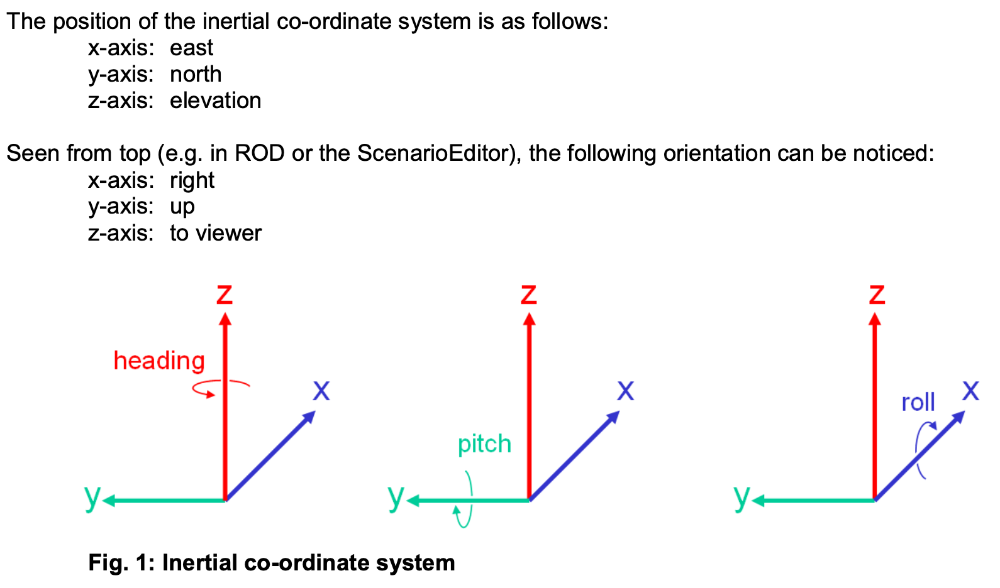

### 1.2 s-t坐标系（来源：OpenDRIVE Format Specification, Rev. 1.4   章节2.3.3）

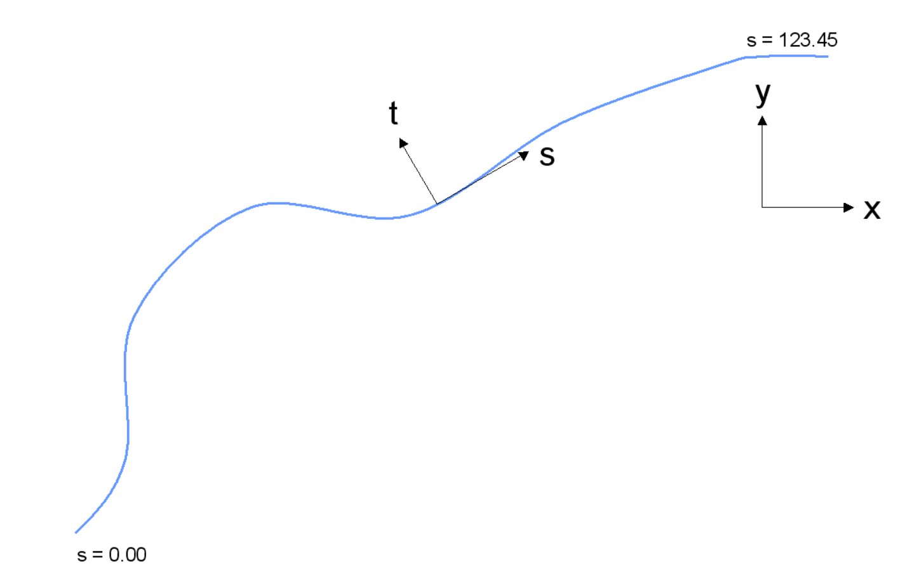

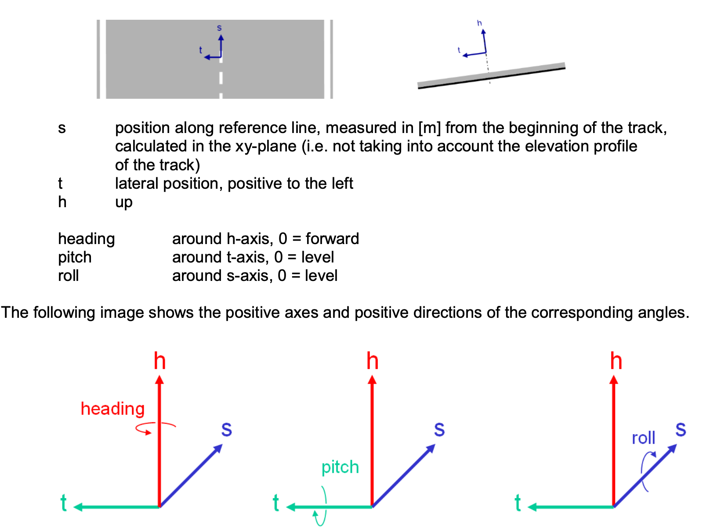

说明：当车辆经过路口时，道路定义为新的一条道路，s-t坐标原点随心道路而更新。即经过一个路口后，车辆的s-t坐标从（0，0）开始计算。当涉及多个路口时，需要确定新道路的起始点定义。当道路存在坡度时，s-t为水平面坐标。

### 1.3 车辆坐标系（来源：*Virtual Test **Drive** User Manual VI2008.076*  章节**3**.2.2）

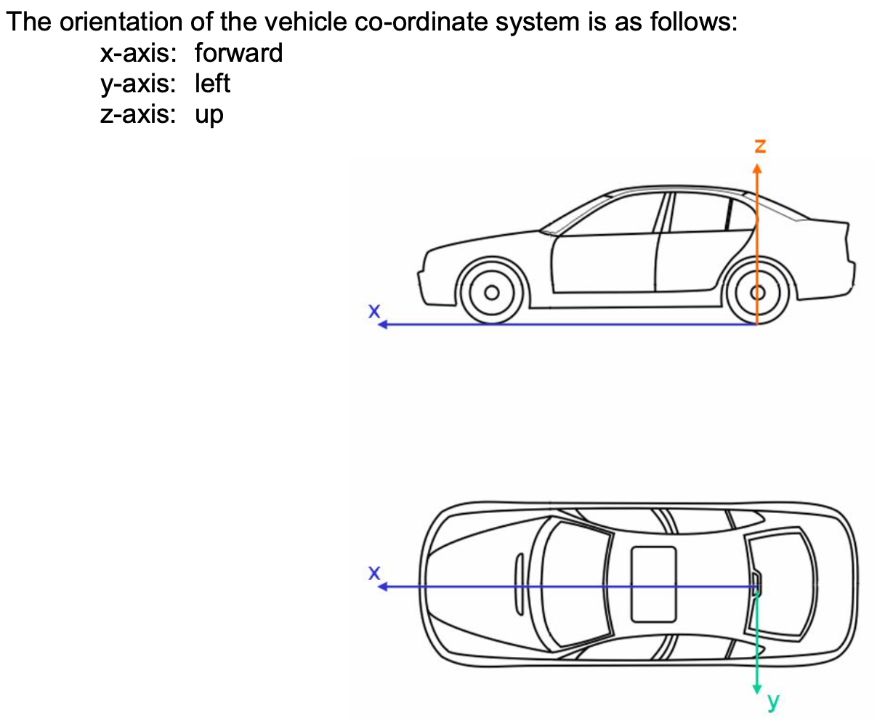

车辆坐标原点：车辆后轴中心在x-y平面上的投影点。

车辆角度定义（来源**SURFACE VEHICLE RECOMMENDED PRACTICE** **SAE J670 JAN2008** 章节4.2.2.1.2）

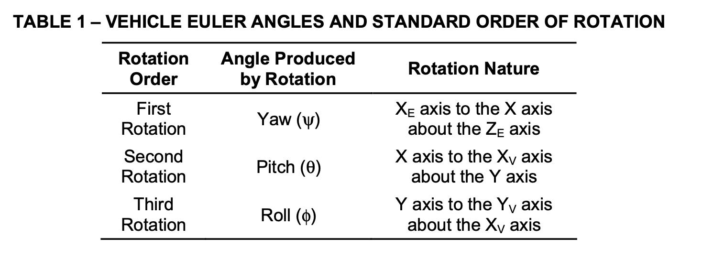

1.Intermediate Axis System (X, Y, Z)—A right-handed orthogonal axis system whose X and Y axes are parallel to the ground plane, with the X axis aligned with the vertical projection of the XV axis onto the ground plane. The Z axis is parallel to the ZE axis. The positive Z axis points upward in the Z-Up orientation. The positive Z axis points downward in the Z-Down orientation.

2.Earth-Fixed Axis System (XE, YE, ZE)—An axis system fixed in the inertial reference. The XE and YE axes are parallel to the ground plane. The ZE axis is aligned with the gravitational vector. The positive ZE axis points upward in the Z-Up orientation. The positive ZE axis points downward in the Z-Down orientation. The orientation of the XE and YE axes is arbitrary and should be based on the needs of the analysis or test.

3.Vehicle Axis System (XV, YV, ZV)—An axis system fixed in the reference frame of the vehicle sprung mass, so that the XV axis is substantially horizontal and points forward (with the vehicle at rest), and is parallel to the vehicle plane of symmetry. The YV axis is perpendicular to the vehicle plane of symmetry. The YV axis points to the left and the ZV axis points upward in the Z-Up orientation. The YV axis points to the right and the ZV axis points downward in the Z-Down orientation. For articulated vehicles, a separate vehicle axis system may be defined for each unit.

## **2 各种角度定义**

### **2.1航向角**

​	地面坐标系X-Y下，车辆质心速度方向与横轴X的夹角。

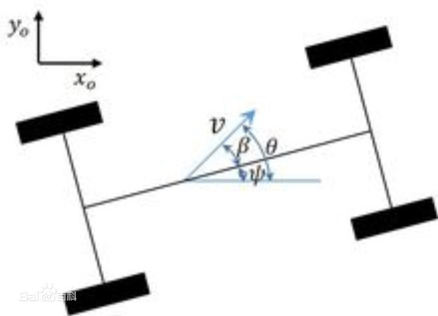

### **2.2 质心侧偏角**

​	地面坐标系X-Y下，车辆质心速度方向与车头指向的夹角。

### **2.3横摆角**

​	地面坐标系X-Y下，车头指向方向与横轴X的夹角。

​     

## 3.**横纵向定义**

### **3.1以车辆本身的横纵向定义**

   车辆纵向：车辆坐标系中的X方向，车头方向为正。

   车辆横向：车辆坐标系中的Y方向，向左为正。

### **3.2以车道线的横纵向定义**（来源：RSS）

To convert the velocity of a vehicle within the situation, one can take the center point of the vehicle and the vehicle orientation in respect to the road area driving direction as basis to split the vehicle speed into its lateral and longitudinal components in respect to the borders of the road area.

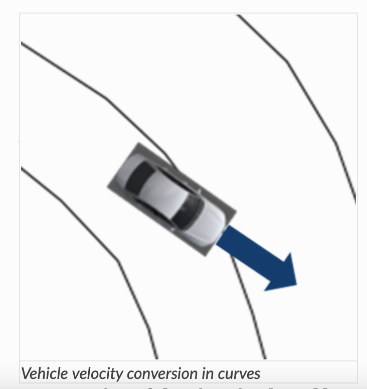

when the lane is not straight anymore. When driving with 20∘ in respect to the lane at the center point. For the center point one gets a longitudinal velocity component of vlon=cos(20∘)∗10m/s=9.4m/s and a lateral velocity component of vlat=sin(20∘)∗10m/s=3.4m/s.J

## **4.前车与目标车辆**定义

前车：与本车同向、同路，并在本车前向行驶的车辆。（来源：GB/T 20608-2006）

forward vehicle: vehicle in front of the subject vehicel(SV), which is moving in the same direction and traveling in the same path, or which is oriented in the same direction if it is not moving.(来源：BS ISO 22839:2013)

目标车辆：在自车前方行驶轨迹线上，距离自车最近的前车，它是车辆前向碰撞预警系统工作时所针对的对象。（来源：GB/T 33577-2017）

## **5.车辆x方向到s方向的夹角说明**

(1)当车辆在车道上行驶时，车辆坐标系x方向与车道中心线之间的锐角；

(2)如下图所示，当车辆从左往右行驶时，车辆x方向偏向于车道中心线左侧时，夹角为负，车辆x方向偏向于车道中心线右侧时，夹角为正；当车辆从右往左行驶时，车辆x方向偏向于车道中心线左侧时，夹角为负，车辆x方向偏向于车道中心线右侧时，夹角为正；

(3)夹角范围[$-\frac{π}{2}$,$\frac{π}{2}$]。

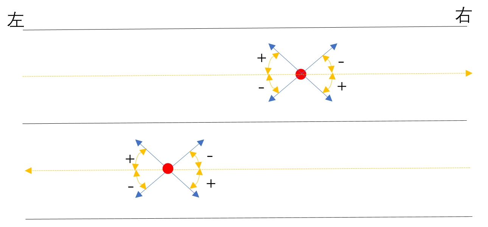

## **6.车辆参考点到道路中心线的偏移量的说明**

(1)当车辆在车道上行驶时，车辆参考点在车道中心线左侧时，车辆参考点到车道中心线之间的距离为正值；

(2)当车辆在车道上行驶时，车辆参考点在车道中心线右侧时，车辆参考点到车道中心线之间的距离为负值。

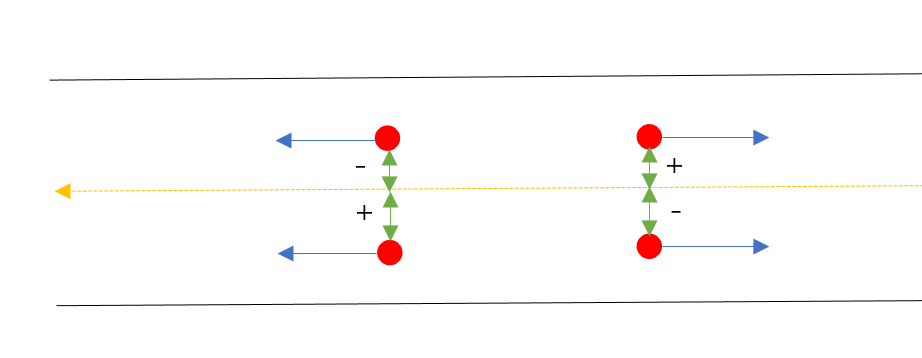

## **7.角度单位说明**

本文档算法中的角度，都采用弧度制（rad)。

# **二.适用场景分类**

如无特别说明，初版指标算法只适用于场景1，场景2。

### **场景（1）：规范场景**

GB/T 33577-2017标准里定义的水平直道或弯道场景，自车车辆坐标系x方向、目标车辆车辆坐标系x方向都与s-t坐标系s方向平行。

### **场景（2）：水平道路拓展场景**

拓展定义水平道路场景，自车车辆坐标系x方向、目标车辆车辆坐标系x方向与s-t坐标系s方向至少有一个不平行。

### **场景（3）：路口场景**

当两车至少有一个位于道路路口或两车之间间隔着路口。

### **场景（4）：坡度场景**

拓展定义有坡度的道路。

目前，有坡度道路的指标计算初版算法暂时不做考虑，但相关计算公式列出如下：

**1.车间距离计算公式**

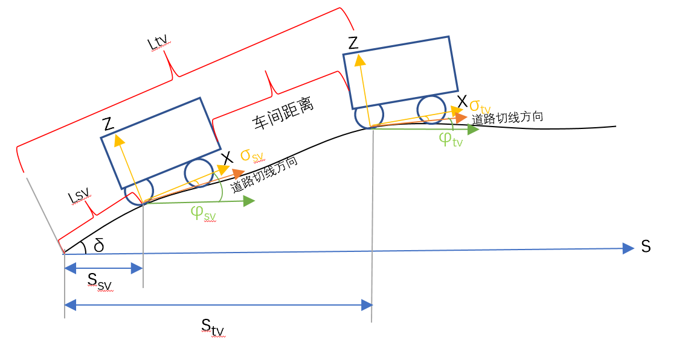

$ Xc(t)=\int{\frac{Stv(t)}{cosδ_{t}}}dStv(t)-\int{\frac{Ssv(t)}												{cosδ_{t}}}dSsv(t)-Dtv(t)*cosα_{tv}(t)-Dsv(t)*cosα_{sv}(t) $  （1）

​	Xc(t)——车间距离；

​	Stv(t)——s-t坐标系下s方向，目标车辆到道路起始点的距离；

​	Ssv(t)——s-t坐标系下s方向，自车到道路起始点的距离；

​	Dtv(t)——车辆坐标系下x方向，目标车辆参考点到车辆后端的距离；

​	Dsv(t)——车辆坐标系下x方向，自车参考点到车辆前端的距离；

​	αtv(t)——目标车辆车辆坐标系x方向与道路切线方向的夹角，[-π/2, π/2]

​    αsv(t)——主车车辆坐标系x方向与与道路切线方向的夹角，[-π/2, π/2]；

​    δ(t)——坡度角，等于车辆相对绝对坐标系俯仰角减去车辆相对道路切面的俯仰角；

   

**公式（1）不适用的情况：**

车辆处于有坡度道路段，当目标车辆发生变道，导致目标车辆识别更改为同车道前方停止的车辆时，现目标车辆（静止在路口的车辆）在VTD中没有历史数据，只有此时刻点数据，此时无法利用历史数据做曲线积分来计算车间距离。

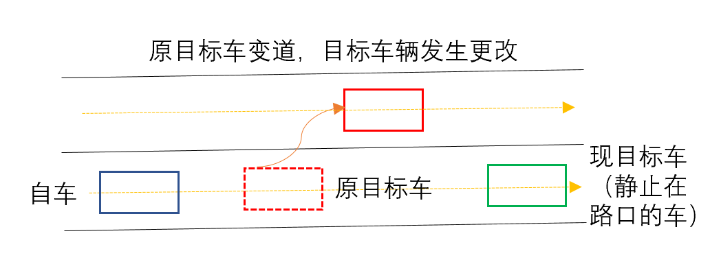

### **场景（5）：车辆俯仰场景**

车辆与道路切面方向存在俯仰角的场景。

目前，俯仰角的计算初版算法暂时不做考虑，但相关计算公式列出如下：

**1.车间距离计算公式**

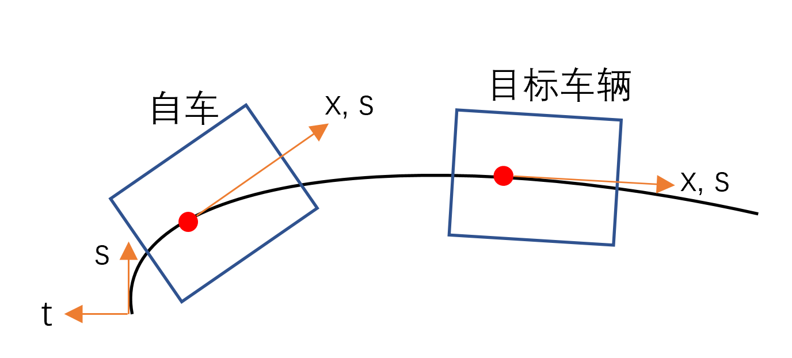

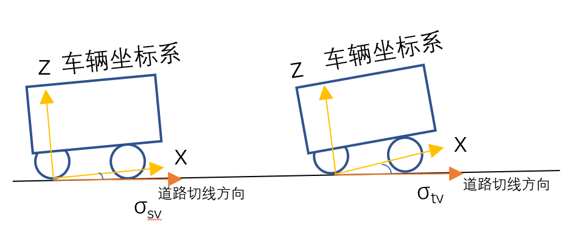

 $ Xc(t)=Stv(t)-Ssv(t)-Dtv(t)*cosσ_{tv}(t)*cosα_{tv}(t)-Dsv(t)*cosσ_{sv}(t)*cosα_{sv}(t)......（2）  $

​    Xc(t)——车间距离；

​	Stv(t)——s-t坐标系下s方向，目标车辆到道路起始点的距离；

​	Ssv(t)——s-t坐标系下s方向，自车到道路起始点的距离；

​	Dtv(t)——车辆坐标系下x方向，目标车辆参考点到车辆后端的距离；

​	Dsv(t)——车辆坐标系下x方向，自车参考点到车辆前端的距离；

​	αtv(t)——目标车辆车辆坐标系x方向与s-t坐标系s方向的夹角，[-π/2, π/2]

​    αsv(t)——主车车辆坐标系x方向与s-t坐标系s方向的夹角，[-π/2, π/2]；

​    σsv(t)——自车车辆坐标系x方向与道路切面的俯仰角；

​    σtv(t)——目标车辆车辆坐标系x方向与道路切面的俯仰角；

**2.相对速度计算公式**

$ Vr(t)=Vtv(t)*cosσ_{tv}(t)*cos(α_{tv}(t)+β_{tv}(t))-Vsv(t)*cosσ_{sv}(t)cosα_{sv}(t) ...... (3) $             

​	Vr(t)——相对速度

​	Vtv(t)——目标车辆车辆坐标系x方向速度；

​	Vsv(t)——自车车辆坐标系x方向速度；

   αtv(t)——目标车辆车辆坐标系x方向与s-t坐标系s方向的夹角；

   αsv(t)——自车车辆坐标系x方向与s-t坐标系s方向的夹角；

   σsv(t)——自车车辆坐标系x方向与道路切面的俯仰角；

   σtv(t)——目标车辆车辆坐标系x方向与道路切面的俯仰角；

# **二.评价指标定义**

## <u>**1.车间距离**</u>

### **1.1车间距离标准定义**

​	定义：自车车头到目标车辆车尾的距离。

​	来源：GB/T 33577-2017

​	标准计算公式：无

​	指标用途：用于计算TTC,要求减速度，用于判断是否发出碰撞预警。(根据GB/T 33577-2017理解)

### **1.2函数计算公式**

​	标准规定应用场景：水平道路上，自车车辆坐标系x方向、目标车辆车辆坐标系x方向都与s-t坐标系s方向平行，车间距离为自车车头到目标车头车辆车尾在s方向上的距离。

1. 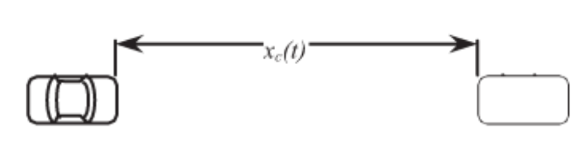

   根据标准自定义计算公式：

​     								$ Xc(t)=Stv(t)-Ssv(t)-Dtv(t)*cosα_{tv}(t)-Dsv(t)*cosα_{sv}(t)......（4） $

​	

​    Xc(t)——车间距离；

​	Stv(t)——s-t坐标系下s方向，目标车辆到道路起始点的距离；

​	Ssv(t)——s-t坐标系下s方向，自车到道路起始点的距离；

​	Dtv(t)——车辆坐标系下x方向，目标车辆参考点到车辆后端的距离；

​	Dsv(t)——车辆坐标系下x方向，自车参考点到车辆前端的距离；

​	αtv(t)——目标车辆车辆坐标系x方向与s-t坐标系s方向的夹角，[-π/2, π/2]

​    αsv(t)——主车车辆坐标系x方向与s-t坐标系s方向的夹角，[-π/2, π/2]；

### **1.3 函数说明**

**输入参数**

​	（1）s-t坐标系下s方向，目标车辆到道路起始点的距离

​	（2）s-t坐标系下s方向，自车到道路起始点的距离

​	（3）车辆坐标系下x方向，目标车辆参考点到车辆后端的距离

​	（4）车辆坐标系下x方向，自车参考点到车辆前端的距离

​	（5）自车车辆坐标系x方向与s-t坐标系s方向的夹角

​    （6）目标车辆车辆坐标系x方向与s-t坐标系s方向的夹角

**输出参数**

​		(1)车间距离

**适用性**

1.当主车与目标车辆两车车辆坐标系x方向与s-t坐标系s方向的夹角的绝对值一个大于π/2, 一个小于π/2, 两车不再是同向行驶，计算车间距离无意义，此时函数返回值为-1。

## <u>**2.相对速度**</u>

### **1.1相对速度标准定义**

​	定义：自车与目标车辆的纵向车速之差。

​	来源：GB/T 33577-2017

​	标准计算公式：

​																			$ Vr(t)=Vtv(t)-Vsv(t) ...... (5) $

​	Vr(t)——相对速度

​	Vtv(t)——目标车辆纵向速度

​	Vsv(t)——自车车辆纵向速度

​	指标用途：用于计算TTC,要求减速度，用于判断是否发出碰撞预警。(根据GB/T 33577-2017理解)

### **1.2函数计算公式**

​	水平道路上，相对速度为目标车辆x方向速度沿s方向与自车x方向速度沿s方向的速度之差。

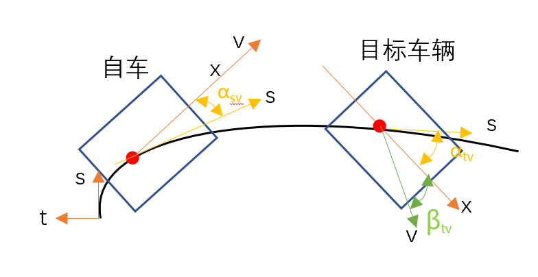

​	计算公式：

​																	

​                                                    $ Vr(t)=Vtv(t)*cosα_{tv}(t)-Vsv(t)*cosα_{sv}(t) ...... (6) $ 

​	Vr(t)——相对速度

​	Vtv(t)——目标车辆车辆坐标系x方向速度；

​	Vsv(t)——自车车辆坐标系x方向速度；

   αtv(t)——目标车辆车辆坐标系x方向与s-t坐标系s方向的夹角；

   αsv(t)——自车车辆坐标系x方向与s-t坐标系s方向的夹角；

### **1.3函数说明**

**输入参数**

​	（1）目标车辆车辆坐标系x方向速度

​	（2）自车车辆坐标系x方向速度

​	（3）目标车辆车辆坐标系x方向与s-t坐标系s方向的夹角

​    （4）自车车辆坐标系x方向与s-t坐标系s方向的夹角

**输出参数**

​		(1)相对速度

 **适用性**

以下场景为相对速度不能作为作为判断是否碰撞的指标：当自车与目标车辆速度垂直时，相对速度不能作为是否发生碰撞的评价指标。

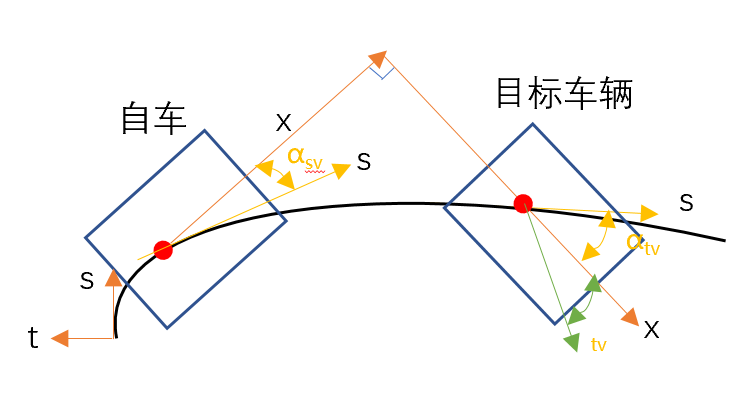

# <u>**3.横向偏移量**</u>

### **1.1横向偏移量标准定义**

​	定义：自车与目标车辆的纵向中心线之间的横向距离，以相对于自车宽度的百分比作为度量单位。当自车与目标车辆中心线平齐时，横向偏移量为零。

​	来源：GB/T 33577-2017

​	标准计算公式：无

​    指标用途：用于确定探测到的前车与自车的相对位置。（来源：根据GB/T 33577-2017理解）

### **1.2函数计算公式**

水平道路上：横向偏移量为目标车辆参考点在t方向与自车参考点在t方向上距离。

自定义计算公式：

​																							$ L(t)=\frac{|Dtv(t)-Dsv(t)|}{L_W}*100\%......(7) $ 

L(t)——横向偏移量；

Dtv(t)——目标车辆参考点在t方向到车辆中心车道线之间的距离；

Dsv(t)——自车参考点在t方向到车辆中心车道线之间的距离；

Lw——车辆宽度；

### **1.3 函数说明**

**输入参数**

​	（1）目标车辆参考点在t方向上到中心车道线之间的距离

​	（2）自车参考点在t方向上到中心车道线之间的距离

​    （3）车辆宽度

**输出参数**

​    （1）横向偏移量（为百分数）

# <u>**4.车头时距**</u>

### **1.1车头时距标准定义**

​	定义：用时间表示在同一路径上行驶的两车之间的距离。通过两车的车间距离除以自车速度计算。

​	来源：GB/T 33577-2017

​	标准计算公式：

​																								$ t=\frac{Xc(t)}{Vsv(t)}......(8) $

​    XC(t)——车间距离；

​    Vsv(t)——自车速度；

   指标用途：用于判定是否发生会碰撞的指标。（来源：根据GB/T 33577-2017理解)

### **1.2函数计算公式**

车头时距为目标车辆与自车的在s方向上车间距离除以自车s方向速度。

计算公式：

​																								$ t=\frac{Xc(t)}{Vsv(t)*cosα_{sv}(t)}......(9) $  

​										

 XC(t)——两车在s方向上的车间距离；

 Vsv(t)——自车在x方向上的速度；

αsv(t)——自车车辆车辆坐标系x方向与s-t坐标系s方向的夹角；				

### **1.3 函数说明**

**输入参数**

​	（1）s-t坐标系下s方向，目标车辆到道路起始点的距离

​	（2）s-t坐标系下s方向，自车到道路起始点的距离

​	（3）车辆坐标系下x方向，目标车辆参考点到车辆后端的距离

​	（4）车辆坐标系下x方向，自车参考点到车辆前端的距离

​	（5）自车车辆坐标系x方向与s-t坐标系s方向的夹角

​    （6）目标车辆车辆坐标系x方向与s-t坐标系s方向的夹角

​	（7）自车在x方向上的速度

**输出参数**

​    （1）车头时距	

**适用性**			

公式（9）适用于：

（1）Vsv(t)不等于0同时cosαsv(t)不等于0的情况；

   (2)  当不满足以上条件时，函数返回值为-1。			

# <u>**5.距离碰撞时间TTC**</u>

### **1.1 TTC标准定义**

​	定义：当相对速度不为零时，计算在同一路径上行驶的两车，假定相对速度保持不变时距离碰撞发生的时间。其值可以通过自车与目标车辆的车间距离除以相对速度来估算。

​	来源：GB/T 33577-2017

​	标准计算公式：

​																							$ TTC= \frac{-Xc(t)}{Vr(t)}......(10) $

​    XC(t)——车间距离；

​    Vsv(t)——相对速度；

   指标用途：用于判定是否发生会碰撞的指标。（来源：GB/T 33577-2017）

### **1.2 函数计算公式**

TTC为目标车辆与自车的车间距离除以两车s方向相对速度。

计算公式：

​																							$ TTC= \frac{-Xc(t)}{Vr(t)}......(11) $ 

​	 XC(t)——两车在s方向上的车间距离；

​    Vr(t)——两车在s方向上的相对速度；							

### **1.3 函数说明**

**输入参数**

​	（1）s-t坐标系下s方向，目标车辆到道路起始点的距离

​	（2）s-t坐标系下s方向，自车到道路起始点的距离

​	（3）车辆坐标系下x方向，目标车辆参考点到车辆后端的距离

​	（4）车辆坐标系下x方向，自车参考点到车辆前端的距离

​	（5）自车车辆坐标系x方向与s-t坐标系s方向的夹角

​    （6）目标车辆车辆坐标系x方向与s-t坐标系s方向的夹角

​	（7）自车在x方向上的速度

   （8）目标车辆车辆坐标系x方向速度

**输出参数**

​    （1）TTC	

**适用性**			

公式（11）适用于:

​	(1)当Vr(t)不为0的情况；

​	(2)当不满足以上条件时，函数返回值为-1。

# <u>**6.强化TTC**</u>	

### **1.1 TTC标准定义**

​	定义：当自车与目标车辆的加速度不等，强化距离碰撞时间为考虑自车与目标车辆的加速度，并假定该加速度保持不变时距离碰撞发生的时间。当不满足汁算条件，或ETTC的计算结果为负时，表明上述假定条件下，碰撞不可能发生。

​	来源：GB/T 33577-2017

​	标准计算公式：

​																							$ ETTC= \frac{[-(Vtv-Vsv)-\sqrt{(Vtv-Vsv)^2-2*(a_{tv}-a_{sv})*X_{c})}]}{a_{tv}-a_{sv}}......(12) $

​    XC(t)——车间距离；

​    Vsv(t)——自车速度；

​    Vtv(t)——目标车辆速度；

​	atv(t)——目标车辆车辆坐标系x方向减速度；

​	asv(t)——自车车辆车辆坐标系x方向减速度；

   指标用途：用于判定是否发生会碰撞的指标。（来源：GB/T 33577-2017）

### **1.2 函数计算公式**

当自车与目标车辆的s方向加速度不等，强化距离碰撞时间为考虑自车与目标车辆的s方向加速度，并假定该加速度保持不变时距离碰撞发生的时间。

计算公式：

​     $ ETTC= \frac{[-(Vtv*cosα_{tv}(t)-Vsv*cosα_{sv}(t))-\sqrt{(Vtv*cosα_{tv}(t)-Vsv*cosα_{sv}(t))^2-2*(a_{tv}*cosα_{tv}(t)-a_{sv}*cosα_{sv}(t))*X_{c})}]}{a_{tv}*cosα_{tv}(t)-a_{sv}*cosα_{sv}(t)}......(13) $

​    XC(t)——s方向两车车间距离；

​    Vsv(t)——自车车辆坐标系x方向速度；

​    Vtv(t)——目标车辆车辆坐标系x方向车辆速度；

​	atv(t)——目标车辆车辆坐标系x方向减速度；

​	asv(t)——自车车辆车辆坐标系x方向减速度；

​    αtv(t)——目标车辆车辆坐标系x方向与s-t坐标系s方向的夹角；

​    αsv(t)——自车车辆坐标系x方向与s-t坐标系s方向的夹角；

### **1.3 函数说明**

**输入参数**

​	（1）s-t坐标系下s方向，目标车辆到道路起始点的距离

​	（2）s-t坐标系下s方向，自车到道路起始点的距离

​	（3）车辆坐标系下x方向，目标车辆参考点到车辆后端的距离

​	（4）车辆坐标系下x方向，自车参考点到车辆前端的距离

​	（5）自车车辆坐标系x方向速度

​	   (6)  目标车辆车辆坐标系x方向车辆速度

​	   (7)  目标车辆车辆坐标系x方向减速度

​       (8)  自车车辆车辆坐标系x方向减速度

​       (9)  目标车辆车辆坐标系x方向与s-t坐标系s方向的夹角

​       (10)  自车车辆坐标系x方向与s-t坐标系s方向的夹角

**输出参数**

​    （1）ETTC	

**适用性**			

公式（13）适用于

（1）${a_{tv}*cosα_{tv}(t)-a_{sv}*cosα_{sv}(t)}≠0$ 且${(Vtv*cosα_{tv}(t)-Vsv*cosα_{sv}(t))^2-2*(a_{tv}*cosα_{tv}(t)-a_{sv}*cosα_{sv}(t))*X_{c}}≥0$

（2）当不满足以上条件时，函数返回值为-1。

# <u>**7.要求减速度**</u>

### **1.1 要求减速度标准定义**

​	定义：能够使自车恰好达到与目标车辆相等的车速，且不发生碰撞所需要的最小减速度。

​	来源：GB/T 33577-2017

​	标准计算公式：

​																	$ a_{req}（t） = a_{tv}（t）+\frac{V_r^2（t）}{2*[X_c(t)-X_r(t)]}......(14) $

areq(t)——要求减速度；

atV(t)——目标车辆减速度；

Xc(t)——两车车间距离；

Xr(t)——驾驶员反应距离；

Vr(t)——两车相对速度；

指标用途：用于判定是否发生会碰撞的指标。（来源：GB/T 33577-2017）

### **1.2函数计算公式**

要求减速度为在道路s方向能够使自车恰好达到与目标车辆相等的车速，且不发生碰撞所需要的最小减速度。

计算公式：

​										$ a_{req}（t） = a_{tv}（t）*cosα_{tv}(t)+\frac{V_r^2（t）}{2*[X_c(t)-Vr(t)*T]}......(15) $ 

areq(t)——要求减速度；

aTV(t)——目标车辆在x方向的减速度；

Xc(t)——两车在s方向上的车间距离；

Vsv(t)——自车在在x方向的速度；

Vr(t)——两车在s方向上的相对速度；

cosαtv(t)——目标车辆车辆坐标系x方向与s-t坐标系s方向的夹角；			
T——驾驶员反应时间；	

### **1.3函数说明**

**输入参数**

​	（1）目标车辆在x方向的减速度

​	（2）s-t坐标系下s方向，目标车辆到道路起始点的距离

​	（3）s-t坐标系下s方向，自车到道路起始点的距离

​	（4）车辆坐标系下x方向，目标车辆参考点到车辆后端的距离

​	（5）车辆坐标系下x方向，自车参考点到车辆前端的距离

​    （6）驾驶员反应时间，默认值取1.5秒

​    （7）目标车辆车辆坐标系x方向速度

​	（8）自车车辆坐标系x方向速度

​	（9）目标车辆车辆坐标系x方向与s-t坐标系s方向的夹角

​    （10）自车车辆坐标系x方向与s-t坐标系s方向的夹角

**输出参数**

​    （1）要求减速度

**适用性**			

公式（15）适用于

   （1）X_c(t)-Vr(t)*T≠0的情况；

   （2）当不满足以上条件时，函数返回值为-1。

# <u>**8.报警距离**</u>		

### **1.1 报警距离标准定义**

定义：系统检测到与前车存在潜在碰撞危险时发出报警时刻的两车间距。

来源：GB/T 33577-2017

标准计算公式：

​								$ D=Vtv(t)*T+(\frac{(Vtv(t))^2}{2a_{tv}(t)}-\frac{(Vsv(t))^2}{2a_{sv}(t)})......（16）  $

指标用途：标准里无定义

### **1.2函数计算公式**

系统检侧到与前车存在潜在碰撞危险时发出报警时刻的两车在s方向的间距。

根据标准自定义计算公式：

​						$ D=Vtv(t)*cosα_{tv}(t)*T+(\frac{(Vtv(t)*cosα_{tv}(t))^2}{2a_{tv}(t)*cosα_{tv}(t)}-\frac{(Vsv(t)*cosα_{sv}(t))^2}{2a_{sv}(t)*cosα_{sv}(t)})......（17） $

​	

​    D——报警距离；

​	Vtv(t)——目标车辆车辆坐标系x方向速度；

​	Vsv(t)——自车车辆车辆坐标系x方向速度；

​	atv(t)——目标车辆车辆坐标系x方向减速度；

​	asv(t)——自车车辆车辆坐标系x方向减速度；

​    T——驾驶员反应时间；

​	αtv(t)——目标车辆车辆坐标系x方向与s-t坐标系s方向的夹角，[-π/2, π/2]

​    αsv(t)——主车车辆坐标系x方向与s-t坐标系s方向的夹角，[-π/2, π/2]；    

### **1.3 函数说明**

**输入参数**

​	（1）目标车辆车辆坐标系x方向速度

​	（2）自车车辆车辆坐标系x方向速度

​    （3）目标车辆车辆坐标系x方向减速度

​    （4）自车车辆车辆坐标系x方向减速度

​    （5）目标车辆车辆坐标系x方向与s-t坐标系s方向的夹角

​    （6）主车车辆坐标系x方向与s-t坐标系s方向的夹角

​    （7）驾驶员反应时间，默认值取1.5秒

**输出参数**

   （1）报警距离

**适用性**		

公式（17）适用于

   （1）atv(t)* αtv(t)≠0且asv(t)*αsv(t)≠0的情况；

   （2）当不满足以上条件时，函数返回值为-1。